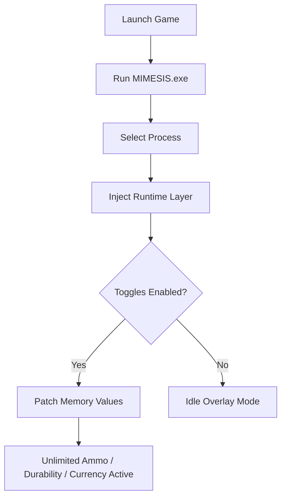

# 💠 MIMESIS Cheat

The **MIMESIS Cheat** is a professional, all-in-one software designed to give players complete mastery over their in-game resources. Built with precision memory hooks and fast toggle logic, it delivers **unlimited item ammo**, **infinite durability**, and **endless currency** without affecting game stability.

Whether you're testing, exploring, or simply enjoying a fully powered run, MIMESIS lets you focus on gameplay — not grind.

---

## ⚙️ Overview

MIMESIS Cheat uses a secure local injection process to modify real-time values during gameplay. It doesn’t rely on external servers or background services, ensuring both stability and safety on modern Windows builds.

Each feature is toggle-based and adjustable through the overlay interface or config file.

---

## 🎯 Key Features

* [x] **Unlimited Item Ammo** — Keep every weapon or consumable at full capacity.
* [x] **Unlimited Item Durability** — Never worry about gear degradation again.
* [x] **Unlimited Currency** — Maintain endless funds for upgrades, crafting, or trading.
* [x] **Profile Switching** — Create per-game profiles for different playstyles or test cases.
* [x] **Overlay Control Panel** — Toggle everything with instant feedback.

> [!NOTE]
> All functions are processed locally; no online dependencies or telemetry are used. Perfect for offline and mod-supported sessions.

---

## 💻 Compatibility

| Platform                   | Status            | Notes                                 |
| -------------------------- | ----------------- | ------------------------------------- |
| **Windows 11/10 (64-bit)** | ✅ Fully Supported | Optimized for DirectX & Vulkan titles |
| **Steam Deck (Proton)**    | ⚠️ Partial        | Overlay may need manual DPI scaling   |
| **Linux (Wine)**           | ⚙️ Experimental   | Configurable through CLI mode         |
| **MacOS**                  | ❌ Unsupported     | No driver-layer support available     |

---

## 🧩 Setup Instructions

### Step 1: Install

Unpack the archive into a secure local folder, then run `MIMESIS.exe` as Administrator.

### Step 2: Configure

Edit your base configuration file to set hotkeys and toggle states:

```ini
[Hotkeys]
UnlimitedAmmo = F2
UnlimitedDurability = F3
UnlimitedCurrency = F4
OverlayToggle = F1
```

### Step 3: Attach & Activate

* Launch the game.
* Select the target process in MIMESIS.
* Click **Attach** → Watch the overlay initialize.

That’s it — your core cheats are now active.

---

## 🧠 Internal Flow



---

## 🛠 Advanced Options

* **Auto-Apply Mode:** Automatically enable cheats when target process is detected.
* **Hot Reload Configs:** Change `.ini` values while the game runs.
* **Multi-Game Templates:** Store multiple profiles with their own toggles and paths.
* **Overlay Theme Editor:** Customize font, opacity, and color scheme.

> [!IMPORTANT]
> Always keep your save files backed up when experimenting with resource manipulation.

---

## ❓ FAQ

**Q1: Can MIMESIS Cheat be used in multiplayer?**
No. It is strictly intended for **single-player or offline testing**. Using it online may violate game terms.

**Q2: My overlay doesn’t appear — what should I do?**
Enable DirectX/Vulkan overlay permissions in your GPU settings or run the program as Administrator.

**Q3: Will my ammo and currency changes persist?**
In most cases, values revert after restarting the game unless the game saves modified states.

**Q4: Is MIMESIS Cheat safe for my system?**
Yes. It contains no external connections or background daemons — it’s a local memory editing tool only.

**Q5: How can I revert to normal gameplay?**
Toggle all features OFF or close MIMESIS before exiting your game to restore normal memory values.

---

## 🧾 Example Config Snippet

```ini
[Profile_A]
GameTitle = Project Aurora
UnlimitedAmmo = true
UnlimitedDurability = true
UnlimitedCurrency = true
OverlayTheme = Dark
AutoAttach = true
```

This configuration automatically enables the three core features when the trainer detects *Project Aurora* running.

---

## 🚀 Final Thoughts

The **MIMESIS Cheat** is built for players who want fast, reliable control over their game resources. No lag, no intrusive software — just precision toggles that work.

Use it to experiment with mechanics, test builds, or simply enjoy unbroken flow through every session.

---

**Dominate. Control. Expand.**
With **MIMESIS Cheat**, your inventory — and your power — never runs dry.
